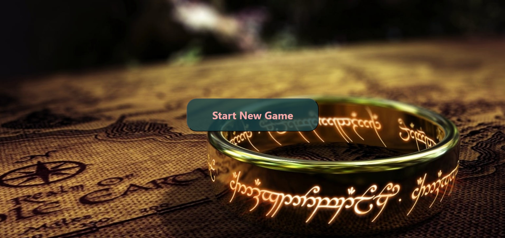

 
 

This is a card flip game. It is fully frontend based where I utilize Vue framework, together with CSS and Javascript. It can be played by two players, counts each other's scores and declares the winner in the end. It can be restarted without reloading. Here's a sneak peek to the game:  

  

  
